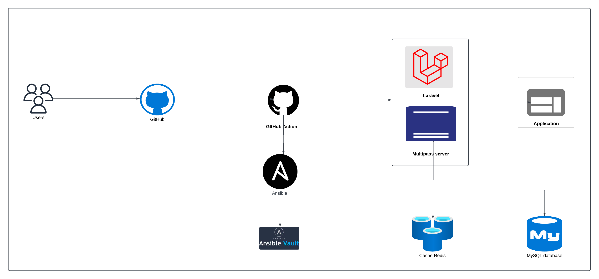
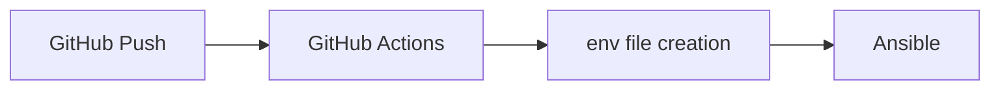

# Laravel Local Deployment ( Docker )

Production-Ready Docker Setup for Laravel Applications

## Quick Setup

```bash
# Clone the repository
git clone <your-repository-url>
cd <repository-name>

# Start Docker environment
docker compose up -d

# Highlights
1. PHP 8.3 with FPM for high-performance scripting.
2. MySQL 8.0 for secure and robust database management.
3. Redis with persistence for caching and session storage.
4. Nginx Web Server for efficient request handling.
5. Automated setup for easy initialization.
6. Built-in health checks to monitor service stability.
7. Volume support to maintain development continuity.


# Common Docker Commands
```bash
# Start containers
docker compose up -d

# Stop containers
docker compose down

# Rebuild containers
docker compose up -d --build

 # View logs
docker compose logs -f
```

## Troubleshooting

### Container Issues
```bash
# Check status
docker compose ps

# View specific service logs
docker compose logs -f [service_name]
```

### Database Connection Issues
```bash
# Check MySQL status
docker compose ps mysql

# View MySQL logs
docker compose logs mysql
```

### Permission Issues
```bash
# Fix storage permissions
docker compose exec <app> chmod -R 775 storage
```


# Laravel Application Remote Deployment

This repository includes automated deployment pipeline using GitHub Actions, and Ansible for application deployment.
We are deploying two multipass servers:
1. One for setting it as self hosted runner.
2. Another for deploying laravel application.

## Prerequisites

1. **Multipass server**:
   - Self Hosted server with 2vCPU and 4GB RAM

      [MultiPass Server Setup](./multipass_server_setup.pdf)


2. **GitHub Secrets**:
   ```
   DB_NAME
   DB_USERNAME
   DB_PASSWORD
   ```

## Architecture



### Workload deployment procedure


## Repository Structure

```
# GitHub Actions workflow

├── .github/
│   └── workflows/
│       └── website-prod-workflow.yml

# Ansible configuration with ansible-vault implemented
├── ansible
│   ├── configure.yml
│   ├── inventory.txt
│   ├── roles
│   │   ├── laravel
│   │   ├── mysql
│   │   ├── nginx
│   │   └── php
│   └── secrets.yml
```

##  Manual Deployment for Ansible

```bash
cd ../ansible
ansible-playbook configure.yml -i inventory.txt --ask-vault-pass <vault-password>
```

## Workflow Monitoring

1. **GitHub Actions**:
   - View workflow runs in GitHub repository Actions tab
   - Check job logs for details

2. **Application**:
   - Check Ansible deployment logs

## Runner Offline Issue

1. **Runner**:
   ```bash
   # Check runner status
   GitHub-Repo > Settings > Actions > Runners > Select runner > Status
   
   # Verify runner permissions
   Start the multipass server
   ```


## Support

1. **Deployment Issues**:
   - Review Ansible verbose output

2. **Application Issues**:
   - Verify Nginx configuration and logs

# Ansible Deployment Configuration

This directory contains Ansible playbooks and roles for deploying the Laravel application on multipass server.

## Directory Structure

```
├── ansible
│   ├── configure.yml
│   ├── inventory.txt
│   ├── README.md
│   ├── roles
│   │   ├── laravel
│   │   │   └── tasks
│   │   │       └── main.yml
│   │   ├── mysql
│   │   │   ├── tasks
│   │   │   │   └── main.yml
│   │   │   └── vars
│   │   │       └── main.yml
│   │   ├── nginx
│   │   │   ├── handlers
│   │   │   │   └── main.yml
│   │   │   ├── tasks
│   │   │   │   └── main.yml
│   │   │   ├── templates
│   │   │   │   └── nginx.conf.j2
│   │   │   └── vars
│   │   │       └── main.yml
│   │   └── php
│   │       ├── tasks
│   │       │   └── main.yml
│   │       └── vars
│   │           └── main.yml
│   └── secrets.yml

The major components of the directory structure are:

1. secrets.yml: This file contains sensitive information like database credentials, which are encrypted using Ansible Vault.
2. configure.yml: This is the main Ansible playbook that orchestrates the deployment process.
3. roles/: This directory contains Ansible roles for different components of the application.
```

### Running Playbooks

1. **Full Installation**:
   ```bash
   ansible-playbook configure.yml -i inventory.txt --ask-vault-pass
   ```

## Debugging

1. **Verbose Output**:
   ```bash
   ansible-playbook configure.yml -vvv
   ```

2. **Check Mode**:
   ```bash
   ansible-playbook configure.yml --check
   ```

3. **List Tasks**:
   ```bash
   ansible-playbook configure.yml --list-tasks
   ```

## Best Practices

1. Use tags for selective execution
2. Implement proper error handling
3. Keep roles focused and modular
4. Use handlers for service restarts

